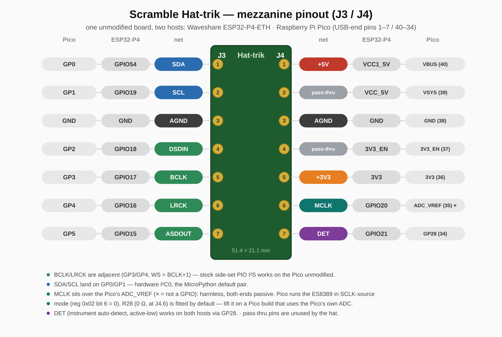

# Scramble Hat-trik — ES8389 Audio Codec HAT

A compact 4-layer audio I/O HAT that stacks on a Waveshare **ESP32-P4** carrier and
gives it a studio-style balanced input and a headset/line output, bridged to the host
over **I²S** (audio) and **I²C** (control). Its headline trick: it taps the carrier's
**802.3 PoE** rail to generate switchable **~48 V-class phantom power** for condenser
microphones — no separate supply.

> **Target carrier:** a Waveshare ESP32-P4-ETH board with PoE module. You will need to solder taps on the output of the bridge rectifiers of the PoE module and connect those wires to J5 on the hat.

---

## Capabilities

- **Balanced analog input** — Neutrik **XLR / ¼″ (6.35 mm) combo** jack (J1) into the
  ES8389 ADC, with input coupling and ESD protection.
- **PoE-tapped phantom power** — ~48 V phantom (tracks the 46–57 V PoE rail) through the
  standard 6.81 kΩ feed pair, **manually switched** (SW1) and **opto-isolated**, with a
  **white presence LED**, a resettable polyfuse, and a TVS rail clamp.
- **Headset / line output** — 3.5 mm **TRRS** jack (J2): stereo output from the DAC plus
  an **electret mic-bias** input path.
- **Stereo audio codec** — Everest **ES8389** (QFN-24): I²S/PCM audio + I²C control.
- **Clean analog power** — ultra-low-noise LDO (TPS7A2033) and ferrite-isolated AVDD.
- **Isolation barrier** — the phantom / XLR side (PGND) is kept separate from the carrier
  audio ground (AGND), bridged only by a **2.2 nF Y2 safety cap** (C19), with a DNP 0 Ω
  ground-lift option (R14).
- **External display header** — 4-pin **I²C** breakout (J6: 3V3 / GND / SDA / SCL) for an
  off-board display.
- **Manufacturable** — JLCPCB gerbers, drills, BOM and placement files are checked in;
  most parts are machine-assembled.

## Signal & power flow

```
  XLR / 6.35" combo (J1) ──coupling──▶ ES8389 ADC ──▶ I²S ──▶ ESP32-P4 carrier
         ▲ phantom
  PoE (J5) ─F1─▶ SW1 ─opto OK1─▶ P-FET Q1 ─▶ 6.81k feed ─▶ XLR pins 2 & 3

  ESP32-P4 carrier ──▶ I²S ──▶ ES8389 DAC ──coupling──▶ TRRS out (J2)
  ESP32-P4 carrier ◀──▶ I²C ◀──▶ ES8389        (+ external display header J6)
```

## Connectors & controls

| Ref | Part | Function |
|---|---|---|
| **J1** | Neutrik NCJ6FA-H | XLR / ¼″ combo — balanced mic/line **input**; ¼″ side is a Hi-Z **instrument input** with auto-detect *(hand-solder)* |
| **J2** | CUI SJ-3524 TRRS | 3.5 mm headset — stereo **output** + electret mic *(hand-solder)* |
| **J3, J4** | 1×7 sockets (8.5 mm) | mezzanine to the carrier — I²S, I²C, power |
| **J5** | 1×2 header | **PoE** rail input from the carrier's PoE module *(hand-solder)* |
| **J6** | 1×4 header | external **I²C** display (3V3 / GND / SDA / SCL) — *DNP; hand-fit (top side) only for a display harness. Eurorack builds don't need it: the interposer drives the display directly* |
| **SW1** | SPDT slide | **phantom power** on/off (manual) — *DNP; populate only in builds that use phantom.* Unpopulated = phantom permanently off; for switchless always-on phantom, bridge SW1 pads 1–2 instead |

## Key components

| Ref | Part | Role |
|---|---|---|
| **U1** | Everest ES8389 (QFN-24) | stereo audio codec |
| **U2** | TI TPS7A2033 | ultra-low-noise 3.3 V analog LDO |
| **OK1** | Everlight EL3H7 (80 V) | opto-isolated phantom enable |
| **Q1** | Vishay Si2325DS | P-FET phantom high-side switch |
| **F1** | 100 mA / 60 V PPTC | phantom / PoE overcurrent protection |
| **D6** | SMBJ58CA TVS | PoE-rail clamp |
| **D8** | white LED | phantom-present indicator |
| **C19** | 2.2 nF Y2 | isolation-barrier safety cap |

## Board

- **≈ 51.4 × 21.1 mm**, **4-layer** (F.Cu / In1.Cu / In2.Cu / B.Cu), 1.6 mm.
- Components on **both sides** (SMD top + bottom) plus a few through-hole connectors.
- Enclosure CAD lives in `case/`.

## Host integration

The codec carries audio over **I²S** and is controlled over **I²C**. Its I²C address is
set by the AD0/AD1 straps (R3/R4); R1/R2 are the SDA/SCL pull-ups. Typical firmware is
**ESPHome** or **ESP-ADF** configured for an external I²S codec.

## Mezzanine pinout (J3 / J4)

The header assignment is chosen so **one unmodified board works on two
hosts**: the Waveshare ESP32-P4-ETH carrier it was designed for, and a
**Raspberry Pi Pico** — the hat's footprint (2.54 mm pitch, ~17.8 mm row
spacing, 51 × 21 mm outline) lands exactly on the Pico's USB-end pins
1–7 / 40–34.



| J3 pad | net | P4-ETH | Pico | | J4 pad | net | P4-ETH | Pico |
|---|---|---|---|---|---|---|---|---|
| 1 | `SDA` | GPIO54 | GP0 | | 1 | `+5V` | VCC1_5V | VBUS |
| 2 | `SCL` | GPIO19 | GP1 | | 2 | *pass* | VCC_5V | VSYS |
| 3 | `AGND` | GND | GND | | 3 | `AGND` | GND | GND |
| 4 | `DSDIN` | GPIO18 | GP2 | | 4 | *pass* | 3V3_EN | 3V3_EN |
| 5 | `BCLK` | GPIO17 | GP3 | | 5 | `+3V3` | 3V3 | 3V3(OUT) |
| 6 | `LRCK` | GPIO16 | GP4 | | 6 | `MCLK` | GPIO20 | ADC_VREF — unused |
| 7 | `ASDOUT` | GPIO15 | GP5 | | 7 | `DET` | GPIO21 | GP28 |

Why it lands this way:

- **BCLK/LRCK adjacent** (GP3/GP4, WS = BCLK + 1) — stock side-set PIO
  I²S implementations work unmodified on the Pico.
- **SDA/SCL on GP0/GP1** — a hardware I²C0 pair and MicroPython's default.
- **MCLK sits over the Pico's ADC_VREF**, which is harmless: both ends are
  passive (ADC_VREF is a filtered rail, the codec's MCLK is a hi-Z input),
  so a full 40-pin header can be fitted. The Pico runs the ES8389 in
  **SCLK-source mode** (reg 0x02 bit 6 = 0 — the codec clocks itself from
  BCLK; supported combos cover 44.1 k/48 k at 16/32-bit). The P4 keeps a
  true MCLK on GPIO20. Never jumper a Pico GPIO into a fitted J4.6.
  **R28** (0 Ω 0805, fitted by default) sits in series right at J4.6:
  lift it on a Pico build that uses the Pico's own ADC, so the hat's MCLK
  trace can't couple noise into ADC_VREF — or use its codec-side pad as
  the MCLK injection point for an advanced Pico build (192 kHz needs a
  real MCLK).
- **DET on GP28** — instrument auto-detect readback works on both hosts.

Pico caveats: `+5V` is VBUS, so the analog LDO only runs on USB power;
full-duplex I²S needs a custom PIO RX machine against the TX clocks; no
ES8389 driver exists for the Pico yet (port from ESP-ADF or the mainline
Linux `es8389.c`). For low BCLK jitter set `sys_clk` to 153.6 MHz so
3.072 MHz divides exactly.

## Power & host-connection notes

- **USB-C and PoE at the same time is safe.** The carrier has an onboard
  power mux (PoE-priority P-FET + Schottky), so the supplies never fight
  and the PC's USB port can't be back-driven; the 48 V PoE line side stays
  behind the PoE module's transformer isolation (Y-cap bridge only), with
  or without phantom switched on. Flashing/serial over USB while running
  on PoE is the intended debug workflow.
- **Don't hot-plug USB mid-recording** — the ground-equalization transient
  can print as a pop at +36 dB mic gain. Connect first, then record.
- **Bench use on USB only:** leave phantom off (SW1 open/unpopulated) —
  with phantom on, K1/K2 close and reconnect the unpowered PoE module,
  which injects mains hum into the input.
- **Eurorack builds:** USB-C for flashing/serial works while Synthia
  powers the carrier from the rack — the interposer feeds the carrier's
  pre-mux node (bench-verified), so the same USB power mux applies. Avoid
  leaving USB plugged in with the rack powered off (it back-feeds the
  module's buck output); details in the Synthia repo.

## Microphone setups

Two validated configurations, using the AVB endpoint firmware's controls
(ES8389 PGA via the entity's Mic Gain control; digital gain via the talker's
`ESP_AVB_TALKER_MIC_DIGITAL_GAIN_DB` Kconfig, which also engages an always-on
DC-block ahead of the gain):

| | Condenser (phantom) | Dynamic |
|---|---|---|
| Phantom switch (SW1) | ON | OFF |
| PoE feed (J5) | connected + powered | **disconnect the PoE module** (see note) |
| ES8389 PGA gain | +36 dB | +36 dB (ceiling is +36.5 dB) |
| Digital gain (Kconfig) | 0 dB | **+20 dB** |

Notes:

- **Unpowered PoE module injects mains hum.** With the PoE module installed but
  not powered, the input picks up ~60 Hz mains at near full scale even with SW1
  off — remove/disconnect the module (J5 feed) when running without PoE.
  *(Addressed in the current design: SW1 off now opens both PoE-tap lines
  through the K1/K2 PhotoMOS relays, so the module can stay connected.)*
- Dynamic microphones sit ~20–30 dB below condenser output; the ES8389 PGA
  ceiling (+36.5 dB) alone leaves them ~-40 dBFS, hence the digital gain stage.
- Mic Gain writes above the PGA ceiling **clamp silently** — verify the value
  the response reports, not the value requested.
- The input is wired differential (MIC1P/1N) at the codec; both mic types run
  balanced through the XLR.

## Instrument (guitar) input

The ¼″ side of J1 feeds a high-impedance buffer (U3, ~500 kΩ input) into the
codec's MIC1 channel through an analog mux (U4). Inserting a **mono TS plug**
(guitar cable) shorts the jack's Ring contact to the Sleeve, pulling the
`DET` line low — this automatically switches MIC1 from the XLR mic path to
the buffered instrument path, and is readable by the carrier on **J4.7**
(input, active-low = instrument present). Remove the plug (or use an XLR
mic) and the input returns to the mic path. Phantom power never reaches the
¼″ contacts.

**Hardwiring a guitar without installing the Neutrik connector** — three
connections on the J1 footprint, not two:

| Guitar wire | Pad | Note |
|---|---|---|
| Tip (signal) | either **T** pad | the two T holes are the same net (`GTIP`); one is enough |
| Sleeve (ground) | **S** pad | `PGND`; the larger **G** pad is the same net if a thicker wire is used |
| — | jumper **R → S** | **required.** With no jack fitted, nothing shorts Ring to Sleeve, so `DET` stays high and the mux stays on the (absent) XLR path — the guitar would be silent. The jumper forces instrument mode. Easiest form: populate **R27** (0805 0 Ω, DNP by default) — it shorts `DET` to `PGND` on-board. Remove/leave it off if the Neutrik is fitted. |

**Eurorack module link (J7):** instead of hand-wiring, an optional 1×4
female socket **J7** (8.5 mm stacking, same series as J3/J4, DNP by
default) direct-mates the **Synthia** eurorack interposer's J8 header. Populate J7
**only when J1 is absent** (they use the same input path), and populate
**R27** with it (the module's input jack can't pull `DET` low). Pinout:
1 = `GTIP`, 2 = `PGND`, 3 = `AGND`, 4 = `HP_L_OUT` — signals on the outer
pins with both grounds between them.

**Eurorack + display:** the interposer drives a display directly from its
own display socket (J10, on the main GND/3V3/I²C nets), so **J6 can stay
DNP in eurorack builds** — no bottom-side fitting needed. Fit J6 (top
side) only for a normal display harness in non-rack builds.

**Cable:** use two-core shielded cable (the input is high impedance and
hums otherwise) — one core to **T** (signal), the other core to **S**
(return), and the **shield joined to S at the hat end only**; at the guitar
end connect just the two cores (tip / sleeve) and trim + insulate the
shield. The return current then flows in the tightly-coupled core pair
while the shield does pure screening — bonding it at both ends would let
ground-loop and pickup currents flow through it in series with the signal.
For very short runs (a few cm) plain coax — center to T, shield as the
return to S, connected at both ends — also works.

## Mono amplifier output (hardwiring J2)

To feed a mono amplifier that expects only tip and sleeve, skip the 3.5 mm jack
and solder wires directly to the J2 footprint. **Careful:** J2 is wired as a
**CTIA TRRS** headset jack, so the pad named `S` is *not* ground — on CTIA the
physical sleeve is the microphone conductor.

| Amp wire | Pad | Note |
|---|---|---|
| Tip (signal) | **T** | `HP_L_OUT` — left audio channel |
| Sleeve (ground) | **TN** | `AGND` — audio ground. **Do not use the `S` pad**: it is the headset-mic line (`MIC2_RAW`) and carries mic bias — grounding it gives hum and injects into the MIC2 input. |

Notes:

- This taps the **left channel only**; have firmware output a mono downmix if
  the source is stereo. Do **not** bridge the `T` and `R` pads to "sum" the
  channels — that shorts the two DAC output stages into each other. (A passive
  sum, if ever wanted, is a ~1 kΩ resistor from each of T and R into the amp
  tip.)
- An amp input (typically ≥10 kΩ) is a much lighter load than headphones, so
  the 22 µF output coupling caps give essentially full bass extension here.
- Unlike the J1 guitar hardwire, **no jumper is required** — J2 has no
  plug-detect circuit.
- **Cable:** use two-core shielded cable — one core to **T** (signal), the
  other core to **TN** (return), **shield joined to TN at the hat end
  only**; at the amp end connect just the two cores (tip / sleeve) and
  trim + insulate the shield. This keeps the shield free of audio and
  ground-loop current (which its resistance would otherwise convert to hum
  in series with the signal) while still screening the run. This link is
  forgiving (low-Z source into a ≥10 kΩ amp input), so for runs under
  ~10 cm plain coax with the shield as the return, connected at both ends,
  is also fine.

## Repository layout

| Path | Contents |
|---|---|
| `scramble_hat.kicad_sch` / `.kicad_pcb` | hierarchical schematic + layout |
| `BOM.csv` | bill of materials — **single source of truth** |
| `fab/` | JLCPCB gerbers, drills, BOM, CPL — see [`fab/README.md`](fab/README.md) |
| `tools/gen_fab.py` | regenerate every production file from the design |
| `tools/check_sync.py` | verify schematic ↔ PCB netlist agreement |
| `lib/` | project symbols, footprints, 3D models |
| `case/` | enclosure CAD |
| `brackets/` | mounting-bracket / faceplate CAD (guitar, amp, eurorack) |
| `docs/` | schematic + silkscreen PDFs |

## Manufacturing

See **[`fab/README.md`](fab/README.md)** for the full ordering guide. In short: JLCPCB
fabricates and assembles most parts; you **hand-solder J1, J2, J5 and C19** (the Y-cap),
and **R14 is left unpopulated** (DNP ground-lift jumper). **J6** (display header) is also
DNP — hand-fit it only when a display is used (top side normally, bottom side for the
eurorack stack). Regenerate all fab outputs with:

```sh
python3 tools/gen_fab.py
```

> ⚠️ Before committing an assembly order, verify part rotations in JLCPCB's preview —
> especially **U1** (the QFN's rotation is applied manually and is a best estimate).
